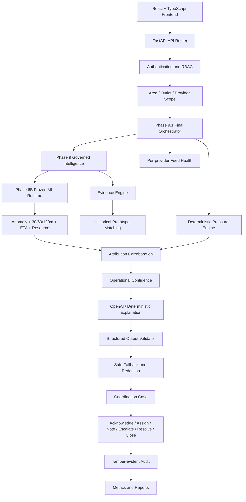
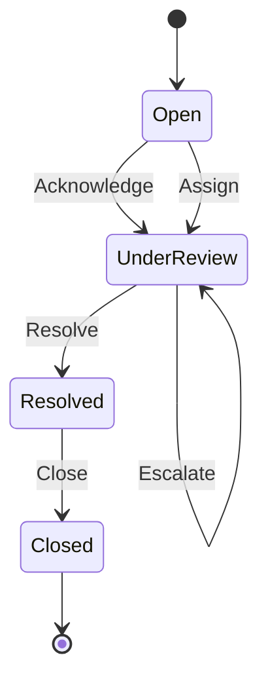

# SuperAgent Sentinel V2

> A safe, explainable, multi-provider liquidity and anomaly decision-support platform for mobile financial-service agents.

[](#technology-stack)
[](#technology-stack)
[](#model-architecture)
[](#governed-intelligence-and-safety)
[](#testing-and-verification)
[](#responsible-ai-and-safety-boundaries)

**Repository:** `https://github.com/MrNowYouSeeMe/super-agent-sentinel-v2`

## At a Glance

| 📌 Item | 📊 Value |
|:---|:---|
| **Logical dataset groups** | **3** |
| **Expected dataset artifacts** | **11** |
| **Full historical rows** | **841,984** |
| **Final five-minute training rows** | **120,000** |
| **Blind-public prediction rows** | **48,000** |
| **Transformed model features** | **60** |
| **Backend regression tests** | **51 passed** |
| **Final model version** | `phase6b-1.0.0` |
| **Final governance version** | `phase9.1-1.0.0` |
| **Human review** | **Required for important risk output** |

---

## Project Status

| 🧩 System Area | 📌 Current State | 📝 Implementation Notes |
|:---|:---:|:---|
| **Backend foundation** | ✅ **Complete** | FastAPI, typed contracts, authentication, RBAC, and scoped authorization |
| **ML training** | ✅ **Complete** | Frozen Phase 6B hybrid model |
| **Blind evaluation** | ✅ **Complete** | No retraining or threshold retuning after freeze |
| **Evidence & confidence** | ✅ **Complete** | Phase 9 governed-intelligence layer |
| **Provider security** | ✅ **Complete** | Phase 9.1 provider-aware hardening and redaction |
| **Case workflow** | ✅ **Complete** | Acknowledge → Assign → Escalate → Resolve → Close |
| **OpenAI explanation** | ✅ **Complete** | Environment-only key, output validation, deterministic fallback |
| **Audit & metrics** | ✅ **Complete** | Hash-chained audit and reliability reports |
| **Frontend** | 🟡 **Functional baseline** | React + TypeScript + Vite; polished redesign is the next major task |
| **Deployment** | ⏸️ **Local-first** | Deployment intentionally excluded from the current phase |
| **Real financial integration** | 🚫 **Out of scope** | No wallet access, settlement, fund movement, or production-provider connection |

---

## Table of Contents

1. [Problem](#problem)
2. [Solution](#solution)
3. [Challenge Coverage](#challenge-coverage)
4. [Core Safety Boundaries](#core-safety-boundaries)
5. [Technology Stack](#technology-stack)
6. [System Architecture](#system-architecture)
7. [Repository Structure](#repository-structure)
8. [Dataset Inventory](#dataset-inventory)
9. [Data Schema](#data-schema)
10. [Feature Engineering](#feature-engineering)
11. [Model Architecture](#model-architecture)
12. [Training and Blind-Test Discipline](#training-and-blind-test-discipline)
13. [Evaluation Results](#evaluation-results)
14. [Governed Intelligence and Safety](#governed-intelligence-and-safety)
15. [OpenAI Explanation Layer](#openai-explanation-layer)
16. [Case Coordination Workflow](#case-coordination-workflow)
17. [Authentication and Authorization](#authentication-and-authorization)
18. [API Reference](#api-reference)
19. [Environment Configuration](#environment-configuration)
20. [Local Setup](#local-setup)
21. [Running the Application](#running-the-application)
22. [Testing and Verification](#testing-and-verification)
23. [Demo Scenarios](#demo-scenarios)
24. [Frontend Integration Rules](#frontend-integration-rules)
25. [Artifact and Dataset Policy](#artifact-and-dataset-policy)
26. [Reports and Documentation](#reports-and-documentation)
27. [Known Limitations](#known-limitations)
28. [Development History](#development-history)
29. [Troubleshooting](#troubleshooting)
30. [Final Disclaimer](#final-disclaimer)

---

# Problem

A multi-provider mobile financial-service agent may serve customers of bKash, Nagad, Rocket, or other providers from the same outlet.

The outlet usually has:

- one **shared physical-cash reserve**;
- one logically separate **bKash e-money balance**;
- one logically separate **Nagad e-money balance**;
- one logically separate **Rocket e-money balance**.

These balances are not interchangeable.

An outlet may appear healthy if every balance is added together, but service may still fail because:

- one provider’s e-money balance is nearly exhausted;
- shared physical cash is falling too quickly;
- cash-out demand becomes concentrated on one provider;
- repeated or near-identical transactions appear;
- the activity is unusual but may still have a legitimate Eid, salary-day, market-day, or remittance explanation;
- a provider feed is stale, missing, incomplete, or conflicting;
- nobody knows who should receive, acknowledge, own, escalate, or resolve the alert.

---

# Solution

SuperAgent Sentinel V2 combines:

```text
Multi-provider balances
+ shared physical cash
+ anomaly detection
+ shortage prediction
+ evidence
+ uncertainty
+ provider-aware security
+ human coordination
+ auditability
```

The platform answers:

- What is the shared physical-cash position?
- What is each provider’s independent e-money position?
- Which resource is under pressure?
- Is shortage likely within 30, 60, or 120 minutes?
- What is the estimated time to shortage?
- Why was the activity flagged?
- Is there a possible legitimate explanation?
- Is the data fresh and internally consistent?
- How confident is the operational conclusion?
- Which stakeholder should receive the alert?
- Who owns the case?
- Was it acknowledged, escalated, resolved, and audited?

---

# Challenge Coverage

| ✅ | 🎯 Challenge Requirement | 🛠️ Implementation |
|:---:|:---|:---|
| ✅ | **Shared physical cash** | Dedicated cash-balance, burn-rate, and runway features |
| ✅ | **Separate provider balances** | bKash, Nagad, and Rocket remain logically independent |
| ✅ | **Forward-looking liquidity** | 30m, 60m, and 120m shortage classifiers plus ETA regressor |
| ✅ | **Unusual activity detection** | Anomaly model combined with deterministic evidence rules |
| ✅ | **Explainable evidence** | Evidence codes, statements, strengths, sources, and observed values |
| ✅ | **Uncertainty** | Operational confidence and explicit uncertainty text |
| ✅ | **Legitimate context** | Festival, salary, remittance, market-day, and network-recovery context |
| ✅ | **Safe fallback** | Confidence caps, verification route, and ETA hiding |
| ✅ | **Correct stakeholder** | Deterministic and scope-aware routing |
| ✅ | **Case ownership** | Owner assignment and lifecycle tracking |
| ✅ | **Acknowledgement** | Explicit acknowledgement transition |
| ✅ | **Escalation** | Target role, reason, actor, and timestamp |
| ✅ | **Resolution** | Resolve and close transitions |
| ✅ | **Provider boundary** | Provider authorization, filtering, and response redaction |
| ✅ | **Human review** | Mandatory for important risk output |
| ✅ | **Auditability** | Append-only logs plus Phase 9.1 hash chain |
| ✅ | **Measured engineering evidence** | Blind metrics, latency, fallback, idempotency, and audit checks |
| ✅ | **English / Bangla / Banglish** | Request-level explanation language support |
| ✅ | **No unsafe financial action** | No transfer, settlement, refill, block, freeze, or fraud verdict |

---

# Core Safety Boundaries

This system is a **decision-support prototype**.

It does not:

- execute transactions;
- move or transfer money;
- refill wallets;
- convert one provider balance into another;
- merge provider wallets;
- automatically block accounts;
- freeze funds;
- accuse an agent or customer;
- issue a final fraud decision;
- access real customer credentials;
- connect to production provider APIs;
- collect PINs, OTPs, passwords, or private keys.

All important outputs remain advisory and require human verification.

---

# Technology Stack

## Backend

- Python
- FastAPI
- Pydantic
- pydantic-settings
- pandas
- NumPy
- scikit-learn
- joblib
- pytest
- OpenAI API
- Local JSON/JSONL prototype runtime stores

## Frontend

- React
- TypeScript
- Vite
- CSS
- Browser `fetch`/HTTP integration

## Local Development

- Windows PowerShell
- Git
- Python virtual environment
- Node.js and npm

---

# System Architecture



## Runtime Request Flow

```text
HTTP request
→ FastAPI route
→ authentication
→ area/outlet permission
→ Pydantic validation
→ rate limiting
→ actor-scoped idempotency
→ Phase 9 analysis
→ frozen Phase 6B model
→ evidence and historical matches
→ context and confidence
→ OpenAI explanation
→ output validation
→ provider feed assessment
→ deterministic pressure corroboration
→ confidence adjustment
→ provider permission check
→ provider-scope redaction
→ case creation
→ audit event
→ typed response
```

---

# Repository Structure

```text
super-agent-sentinel-v2/
├── backend/
│   ├── app/
│   │   ├── main.py
│   │   ├── api/
│   │   │   └── v1/
│   │   │       └── router.py
│   │   ├── core/
│   │   │   └── config.py
│   │   ├── domain/
│   │   └── services/
│   │       ├── auth.py
│   │       ├── phase6b_runtime.py
│   │       ├── openai_explanation.py
│   │       ├── validation_evidence.py
│   │       ├── phase9_audit.py
│   │       ├── phase9_feedback.py
│   │       ├── phase9_evidence.py
│   │       ├── phase9_governance.py
│   │       ├── phase91_models.py
│   │       ├── phase91_audit.py
│   │       ├── phase91_security.py
│   │       ├── phase91_structured.py
│   │       ├── phase91_case_workflow.py
│   │       ├── phase91_guard.py
│   │       ├── phase91_service.py
│   │       └── phase91_metrics.py
│   ├── tests/
│   └── requirements.txt
│
├── frontend/
│   ├── src/
│   ├── package.json
│   ├── tsconfig.json
│   └── vite.config.ts
│
├── data/
│   ├── raw/
│   │   ├── train/
│   │   └── blind_test/
│   ├── private/
│   ├── manifests/
│   ├── reference/
│   └── source_archives/
│
├── artifacts/
│   ├── evidence/
│   ├── models/
│   └── predictions/
│
├── reports/
│   ├── dataset_audit/
│   ├── model_training/
│   ├── model_evaluation/
│   └── final/
│
├── docs/
├── scripts/
├── runtime/
├── .env.example
├── .gitignore
├── requirements-data.txt
├── requirements-ml.txt
└── README.md
```

---

# Dataset Inventory

The project uses **three logical dataset groups** containing **eleven expected source artifacts**.

## Group A — Training and Historical Data

| 📦 Dataset Artifact | 🎯 Purpose | 📊 Size / Status |
|:---|:---|---:|
| `data/raw/train/agents.csv` | Training-agent metadata | 🧪 Synthetic |
| `data/raw/train/providers.csv` | Provider metadata and provider separation | 🧪 Synthetic |
| `data/raw/train/agent_pickles/` | Full per-agent historical windows | **841,984 rows** |
| `data/raw/train/model_ready_train_sample_50000.csv.gz` | Model-ready schema and audit sample | **50,000 rows** |
| `data/raw/train/transaction_event_sample_2024_2025.csv.gz` | Historical transaction-event analysis sample | 🧪 Synthetic sample |
| `data/raw/train/pressure_stress_train_5m.csv.gz` | Exact five-minute benchmark used for final model training | **120,000 rows** |

## Group B — Blind Public Inputs

| 📦 Blind-Public Artifact | 🎯 Purpose | 📊 Size / Status |
|:---|:---|---:|
| `data/raw/blind_test/public/agents_test.csv` | Blind-test agent metadata | Includes unseen-agent coverage |
| `data/raw/blind_test/public/model_ready_test_sample_20000.csv.gz` | Public schema-compatible test sample | **20,000 rows** |
| `data/raw/blind_test/public/transaction_event_sample_2026H1.csv.gz` | 2026 H1 transaction-event sample | 🧪 Synthetic public input |
| `data/raw/blind_test/public/pressure_stress_test_5m.csv.gz` | Exact blind-public prediction input | **48,000 rows** |

## Group C — Private Blind Ground Truth

| 🔒 Private Artifact | 🎯 Purpose | 🛡️ Access Policy |
|:---|:---|:---|
| `data/private/blind_test_ground_truth/pressure_stress_labels_private.csv.gz` | One-time frozen evaluation labels | **Not opened during training, feature design, calibration, or threshold tuning** |

## Important Dataset Facts

```text
Full historical rows:              841,984
Full-history unusual positive rate: 0.6520%
Exact five-minute training rows:    120,000
Blind-public prediction rows:        48,000
Model-ready train audit sample:      50,000
Model-ready public test sample:      20,000
```

The extremely low full-history unusual-positive rate is why raw accuracy is not treated as the primary anomaly metric.

---

# Data Schema

The exact five-minute model contract is organized into the following groups.

## Identity and Routing Fields

| 🧱 Field | 📝 Meaning |
|:---|:---|
| `episode_id` | Synthetic scenario or episode identifier |
| `window_id` | Five-minute observation-window identifier |
| `timestamp` | Observation timestamp |
| `area_id` | Operational area identifier |
| `outlet_id` | Agent or outlet identifier |

These identifiers support routing and traceability but are not blindly treated as predictive signals.

## Categorical Context

| 🧱 Field | 📝 Meaning |
|:---|:---|
| `agent_profile` | Standard, high-volume, or another synthetic operating profile |
| `location_type` | Urban, market, rural, or equivalent location context |
| `provider_mix_shift` | Whether recent demand has shifted toward a specific provider |

## Event Context Flags

| 🧱 Field | 🔢 Type | 📝 Meaning |
|:---|:---:|:---|
| `festival_flag` | `0 / 1` | Eid or festival context |
| `salary_flag` | `0 / 1` | Salary-day context |
| `remittance_flag` | `0 / 1` | Remittance-driven demand |
| `market_day_flag` | `0 / 1` | Local market-day activity |
| `network_recovery_flag` | `0 / 1` | Post-outage or network-recovery surge |

## Balance Fields

| 💰 Balance Field | 📝 Meaning |
|:---|:---|
| `shared_cash_balance` | Outlet-level shared physical-cash reserve |
| `bkash_balance` | Separate bKash e-money balance |
| `nagad_balance` | Separate Nagad e-money balance |
| `rocket_balance` | Separate Rocket e-money balance |

Provider balances remain logically separate.

## Five-Minute Transaction Aggregates

| 📈 Aggregate Field | 📝 Meaning |
|:---|:---|
| `tx_count_5m` | Number of transactions in the five-minute window |
| `cash_in_amount_5m` | Total cash-in amount during the window |
| `cash_out_amount_5m` | Total cash-out amount during the window |
| `net_cash_flow_5m` | Net cash flow for the window |

## Unusual-Activity Signals

| 🚨 Signal | 📝 Meaning |
|:---|:---|
| `velocity_vs_baseline` | Current transaction velocity relative to the historical baseline |
| `repeated_amount_ratio` | Concentration of repeated or near-identical transaction amounts |
| `unique_customer_ratio` | Simulated customer-diversity ratio |
| `failure_rate` | Proportion of failed transactions |
| `duplicate_ratio` | Proportion of duplicate-like events |

## Data-Quality Signals

| 🩺 Quality Signal | 📝 Meaning |
|:---|:---|
| `missing_ratio` | Proportion of missing input data |
| `out_of_order_ratio` | Proportion of out-of-order events |
| `feed_age_seconds` | Age of the provider feed in seconds |
| `reconciliation_difference` | Difference between reported and reconciled values |
| `data_quality_score` | Consolidated data-quality score |

## Liquidity Burn and Runway Signals

| 🔥 Burn / Runway Field | 📝 Meaning |
|:---|:---|
| `shared_cash_burn_15m` | Shared physical-cash burn over 15 minutes |
| `shared_cash_burn_30m` | Shared physical-cash burn over 30 minutes |
| `shared_cash_burn_60m` | Shared physical-cash burn over 60 minutes |
| `bkash_burn_60m` | bKash e-money burn over 60 minutes |
| `nagad_burn_60m` | Nagad e-money burn over 60 minutes |
| `rocket_burn_60m` | Rocket e-money burn over 60 minutes |

## Training Targets

| 🎯 Training Target | 🤖 Learning Task |
|:---|:---|
| `is_unusual` | Anomaly or review-risk classification |
| `shortage_within_30m` | Shortage-within-30-minutes classification |
| `shortage_within_60m` | Shortage-within-60-minutes classification |
| `shortage_within_120m` | Shortage-within-120-minutes classification |
| `actual_time_to_shortage_minutes` | Time-to-shortage regression |
| Provider-specific shortage targets | Affected-resource support |
| Affected-service label | Shared cash / bKash / Nagad / Rocket helper target |
| Anomaly-type label | Evaluation and evidence-analysis target |

Targets, future balances, reviewer decisions, intervention fields, and private blind labels are excluded from predictive features.

---

# Feature Engineering

## Base Features

The runtime includes:

- 3 categorical fields;
- 29 base numeric fields;
- time, balance, flow, anomaly, quality, and burn information.

## Derived Numeric Features

```text
hour_sin
hour_cos
dow_sin
dow_cos
month_sin
month_cos
weekend_flag
rush_context_count
cash_out_to_in_ratio
abs_net_cash_flow_5m
min_provider_balance
provider_balance_spread
shared_cash_to_outflow_ratio
shared_cash_burn_to_balance_60m
max_provider_burn_60m
max_provider_burn_to_balance_60m
quality_risk_score
concentration_risk_score
velocity_concentration_interaction
failure_velocity_interaction
```

After categorical preprocessing, the shared model contract produces **60 transformed features**.

## Leakage Controls

The pipeline excludes:

```text
future balances
future_* columns
shortage labels
anomaly labels
affected-service labels
approved support or intervention amounts
reviewer decisions
private blind-test targets
```

Episode-level splitting prevents adjacent windows from the same scenario leaking across train/calibration/validation.

---

# Model Architecture

## Version

```text
Model version: phase6b-1.0.0
Runtime integration: Phase 7
Governance layer: phase9-1.0.0
Final hardening: phase9.1-1.0.0
```

## Model Bundle

```text
artifacts/models/phase6b/phase6b_model_bundle.joblib
```

## Tasks

The bundle contains or supports:

1. anomaly/review-risk classifier;
2. shortage-within-30-minute classifier;
3. shortage-within-60-minute classifier;
4. shortage-within-120-minute classifier;
5. shortage ETA regressor;
6. affected-resource helper;
7. shared preprocessing contract;
8. calibration objects and frozen thresholds.

## Modeling Strategy

- CPU-friendly histogram gradient boosting;
- one shared preprocessing contract;
- episode-separated train/calibration/validation split;
- hard-negative rush windows receive extra weight;
- isotonic probability calibration;
- threshold selection prioritizes F2 while constraining false positives;
- calibrated ML scores are fused with deterministic operational rules;
- data-quality verification and stakeholder routing remain deterministic.

## Output Constraints

The runtime validates:

```text
0 <= every probability <= 1
P(shortage 30m) <= P(shortage 60m) <= P(shortage 120m)
0 <= ETA <= 120 minutes
affected resource ∈ {none, shared_cash, bkash, nagad, rocket}
unreliable data → verification route
important risk → human review
```

---

# Training and Blind-Test Discipline

## Phase 6A — Dataset Audit

The audit covered:

- full historical agent files;
- model-ready schema parity;
- five-minute stress benchmark;
- transaction-event samples;
- agent/provider/context coverage;
- class imbalance;
- missing and duplicate data;
- target/future/intervention leakage;
- unseen-agent coverage;
- provider separation;
- model plan and feature contract.

Generated reports:

```text
reports/dataset_audit/AUDIT_REPORT.md
reports/dataset_audit/audit_summary.json
reports/dataset_audit/agent_file_summary.csv
reports/dataset_audit/full_history_missingness.csv
reports/dataset_audit/model_training_plan.json
reports/dataset_audit/training_feature_contract.json
```

## Phase 6B — Train and Freeze

```text
Training rows:            120,000
Blind-public predictions:  48,000
Transformed features:          60
Private labels opened:         NO
```

The model bundle, thresholds, feature contract, predictions, and hashes were frozen before private labels were opened.

## Phase 6C — One-Time Blind Evaluation

Before evaluation:

- model hashes were verified;
- threshold hashes were verified;
- prediction hashes were verified;
- no retraining occurred;
- no feature change occurred;
- no threshold retuning occurred;
- no prediction regeneration occurred.

Only after verification were private labels joined for evaluation.

---

# Evaluation Results

## Frozen Blind-Test Metrics

| 🧠 Prediction Task | 🎯 Precision | 🔎 Recall | ⚖️ F2 | ⚠️ False-Positive Rate |
|:---|---:|---:|---:|---:|
| **Anomaly detection** | **0.932** · 93.2% | **0.835** · 83.5% | **0.852** · 85.2% | **0.032** · 3.2% |
| **Shortage within 30m** | **0.759** · 75.9% | **0.846** · 84.6% | **0.827** · 82.7% | **0.017** · 1.7% |
| **Shortage within 60m** | **0.745** · 74.5% | **0.685** · 68.5% | **0.696** · 69.6% | **0.025** · 2.5% |
| **Shortage within 120m** | **0.711** · 71.1% | **0.519** · 51.9% | **0.548** · 54.8% | **0.037** · 3.7% |

## Additional Metrics

```text
ETA MAE:                       14.462 minutes
Affected-service accuracy:     44.3%
Primary stakeholder accuracy:  74.3%
Exact routing accuracy:         74.0%
```

## Interpretation

- anomaly precision is strong;
- near-term 30-minute shortage detection is strong;
- 60-minute risk remains useful but less sensitive;
- 120-minute prediction is intentionally treated with more uncertainty;
- affected-service attribution is a known limitation;
- Phase 9.1 reduces confidence when the model and deterministic provider-pressure engine disagree.

These results are measured on synthetic blind data and are not production certification.

---

# Governed Intelligence and Safety

## Phase 9 Evidence Layer

Phase 9 builds structured evidence such as:

```text
VELOCITY_ABOVE_BASELINE
REPEATED_AMOUNT_CONCENTRATION
LOW_CUSTOMER_DIVERSITY
AFFECTED_RESOURCE_RUNWAY
SHORTAGE_60M_MODEL_SIGNAL
DATA_RELIABILITY_LIMIT
LEGITIMATE_RUSH_CONTEXT
TRAINING_PATTERN_SIMILARITY
```

Each evidence item may include:

```text
code
category
statement
source
strength
observed_value
expected_condition
supports
```

## Historical Prototype Index

```text
Source rows: 120,000
Compact prototypes: 153
Private blind labels used: NO
Artifact: artifacts/evidence/phase9_evidence_index.json
```

## Operational Confidence

Operational confidence is not model accuracy.

It combines:

```text
frozen model confidence
probability certainty
evidence strength
data quality
historical similarity
context ambiguity
validation penalties
provider-attribution agreement
provider-feed confidence caps
```

## Per-Provider Feed Health

Supported states:

```text
healthy
degraded
stale
missing
conflict
```

Per-provider assessment can include:

```text
provider
feed_age_seconds
quality_score
missing_ratio
reported_balance
reconciled_balance
conflict_amount
supported_for_decision
confidence_cap
```

## Model vs Deterministic Corroboration

The deterministic engine independently scores:

```text
shared_cash
bkash
nagad
rocket
```

Possible agreement:

```text
confirmed
close
disagreement
insufficient_data
```

A disagreement results in lower confidence and required verification rather than a fabricated confident answer.

---

# OpenAI Explanation Layer

OpenAI is used only for human-readable operator explanation.

It is not used as the authoritative risk engine.

## Configuration

```env
OPENAI_ENABLED=true
OPENAI_MODEL=gpt-5-mini
OPENAI_API_KEY=your_local_secret
```

The API key is loaded from the root `.env` or process environment.

It is never:

- hardcoded in the test script;
- committed to Git;
- exposed through Vite;
- sent to the browser;
- printed in logs.

## Structured Explanation

```text
situation
evidence_ids
uncertainty
normal_alternative
safe_next_step
human_review_required
disclaimer
narrative
language
```

## Validator Checks

- all evidence IDs exist;
- uncertainty is present;
- human review remains required;
- no unsupported percentage;
- no unauthorized provider mention;
- no secret leakage;
- no fraud verdict;
- no freeze/block/transfer recommendation;
- sufficient evidence coverage.

Invalid output automatically falls back to deterministic explanation.

---

# Case Coordination Workflow



## Supported Actions

| 🖥️ User-Facing Action | 🔗 Backend Action | 📌 Result |
|:---|:---:|:---|
| **Acknowledge alert** | `acknowledge` | Marks the case as acknowledged and moves it into review |
| **Assign owner** | `assign` | Associates an authorized owner with the case |
| **Add review note** | `add_note` | Appends a traceable human-review note |
| **Escalate** | `escalate` | Sends the case to the selected stakeholder role |
| **Mark resolved** | `resolve` | Records the resolution after acknowledgement |
| **Close case** | `close` | Closes a previously resolved case |

Rules:

- a case must be acknowledged before resolution;
- only a resolved case may be closed;
- each transition is authenticated, authorized, stored, and audited.

## Tamper-Evident Audit

Phase 9.1 events include:

```text
event_id
analysis_id
event
actor_id
created_at
details
previous_hash
event_hash
```

The audit verifier checks record hashes and previous-hash links.

---

# Authentication and Authorization

Core concepts:

```text
Principal
Permission
current_principal
authorize
AuthorizationError
```

Key permissions include:

```text
ANALYSIS_CREATE
CASE_REVIEW
```

Authorization can use:

```text
role
area_id
outlet_id
provider_id
```

Provider safety is enforced through:

```text
area/outlet authorization
→ analysis
→ predicted-provider authorization
→ response redaction
→ case authorization
```

Frontend button visibility is not treated as security; backend authorization is always final.

---

# API Reference

Base URL:

```text
http://127.0.0.1:8000/api/v1
```

## Authentication

| 🌐 Method | 🔗 Route | 🔐 Access | 🎯 Purpose |
|:---:|:---|:---:|:---|
| `POST` | `/auth/demo-login` | 🟢 Public demo | Obtain a local demo access token |

## Phase 6B Runtime

| 🌐 Method | 🔗 Route | 🔐 Access | 🎯 Purpose |
|:---:|:---|:---:|:---|
| `GET` | `/ml/phase6b/status` | 🟢 Public | Read model and runtime availability |
| `POST` | `/ml/phase6b/predict` | 🔒 Required | Run the frozen Phase 6B prediction contract |

## Phase 9 Governance

| 🌐 Method | 🔗 Route | 🔐 Access | 🎯 Purpose |
|:---:|:---|:---:|:---|
| `GET` | `/ml/phase9/status` | 🟢 Public | Read evidence and governance availability |
| `POST` | `/ml/phase9/analyze` | 🔒 Required | Run governed prediction, evidence, confidence, and explanation |
| `POST` | `/ml/phase9/feedback` | 🔒 Required | Submit authorized human-review feedback |

## Phase 9.1 Final Contract

| 🌐 Method | 🔗 Route | 🔐 Access | 🎯 Purpose |
|:---:|:---|:---:|:---|
| `GET` | `/ml/phase91/status` | 🟢 Public | Read final Phase 9.1 capability status |
| `POST` | `/ml/phase91/analyze` | 🔒 Required | Run final hardened analysis and create/link a case |
| `GET` | `/ml/phase91/cases/{case_id}` | 🔒 Required | Read an authorized coordination case |
| `POST` | `/ml/phase91/cases/{case_id}/transition` | 🔒 Required | Apply an authorized case transition |
| `GET` | `/ml/phase91/audit/verify` | 🔒 Required | Verify the tamper-evident audit chain |
| `GET` | `/ml/phase91/metrics` | 🔒 Required | Read final reliability metrics |

## Analysis Headers

```text
Authorization: Bearer <token>
X-Request-ID: <uuid>
X-Idempotency-Key: <stable-request-key>
```

Idempotency behavior:

```text
same actor + same key + same request
→ previous response replayed

same actor + same key + different request
→ 409 Conflict

different actor + same key
→ allowed
```

## Main Analysis Request Groups

```text
identity and scope
categorical context
event flags
balances
five-minute transaction aggregates
unusual-activity indicators
data-quality indicators
burn/runway indicators
optional per-provider feed assessments
language
OpenAI toggle
```

## Main Analysis Response Groups

```text
request and analysis IDs
model prediction
probabilities
ETA
evidence
historical matches
context assessment
operational confidence
provider-feed assessments
provider attribution
structured explanation
validation state
safe fallback state
stakeholder routing
linked coordination case
safety boundary
```

---

# Environment Configuration

Copy the example:

```powershell
cd E:\superagent-sentinel-v2
Copy-Item .env.example .env
notepad .env
```

Example:

```env
OPENAI_ENABLED=false
OPENAI_MODEL=gpt-5-mini
OPENAI_API_KEY=
```

For live explanation:

```env
OPENAI_ENABLED=true
OPENAI_MODEL=gpt-5-mini
OPENAI_API_KEY=your_real_key_here
```

Security rules:

- `.env` must remain ignored;
- `.env.example` must contain no real secret;
- never create `VITE_OPENAI_API_KEY`;
- OpenAI requests must originate from the backend only.

---

# Local Setup

The project workflow is optimized for Windows PowerShell and the `E:` drive.

## Clone

```powershell
cd E:\
git clone https://github.com/MrNowYouSeeMe/super-agent-sentinel-v2.git
cd E:\super-agent-sentinel-v2
```

Use the actual cloned folder name. The local development folder used during implementation was:

```text
E:\superagent-sentinel-v2
```

## Backend Environment

```powershell
cd E:\superagent-sentinel-v2

py -m venv backend\.venv
.\backend\.venv\Scripts\Activate.ps1

python -m pip install --upgrade pip
pip install -r backend\requirements.txt
pip install -r requirements-data.txt
pip install -r requirements-ml.txt
```

## Frontend Dependencies

```powershell
cd E:\superagent-sentinel-v2\frontend
npm install
```

## Local-Only Artifacts

The Git repository intentionally ignores large/private data and the frozen model bundle.

Before running final ML analysis, ensure:

```text
artifacts/models/phase6b/phase6b_model_bundle.joblib
```

exists locally.

The evidence index is expected at:

```text
artifacts/evidence/phase9_evidence_index.json
```

---

# Running the Application

## Start Backend

Recommended:

```powershell
cd E:\superagent-sentinel-v2\backend
.\.venv\Scripts\Activate.ps1

uvicorn app.main:app --reload --host 127.0.0.1 --port 8000
```

## Start Frontend

Open another PowerShell terminal:

```powershell
cd E:\superagent-sentinel-v2\frontend
npm run dev
```

Typical local URLs:

```text
Backend:  http://127.0.0.1:8000
API:      http://127.0.0.1:8000/api/v1
Frontend: http://127.0.0.1:5173
```

## Production Frontend Build

```powershell
cd E:\superagent-sentinel-v2\frontend
npm run build
```

---

# Testing and Verification

## Full Backend Tests

```powershell
cd E:\superagent-sentinel-v2
.\backend\.venv\Scripts\python.exe -m pytest -q
```

Last verified result:

```text
51 passed
```

The Starlette/httpx deprecation warning is currently non-blocking.

## Frozen Model Smoke

```powershell
.\backend\.venv\Scripts\python.exe scripts\phase7_model_runtime_smoke.py
```

## Phase 9 Governance Smoke

```powershell
.\backend\.venv\Scripts\python.exe scripts\phase9_governance_smoke.py
```

## Phase 9.1 Final Smoke

```powershell
.\backend\.venv\Scripts\python.exe scripts\phase91_final_smoke.py
```

## Reliability Metrics

```powershell
.\backend\.venv\Scripts\python.exe scripts\phase91_final_metrics.py
```

## Safe OpenAI Live Test

```powershell
.\backend\.venv\Scripts\python.exe scripts\test_openai_live.py
```

The test reads the API key from `.env` or the process environment only.

## Frontend Regression Build

```powershell
cd E:\superagent-sentinel-v2\frontend
npm run build
```

## Phase 9.1 Reliability Evidence

```text
Structured output validation:      100%
Degraded-feed fallback:             75%
Idempotency duplicate prevention:  100%
Audit-chain verification:          100%
Provider-scope guard tests:         100%
Model-only latency p50:          43.834 ms
Model-only latency p95:          93.587 ms
```

---

# Demo Scenarios

## A — Hidden Provider Shortage

Show:

- shared cash and provider balances separately;
- one provider near shortage;
- 30/60/120-minute probabilities;
- ETA and confidence;
- evidence;
- safe next step.

## B — Liquidity Pressure with Unusual Activity

Show:

- rapid shared-cash decline;
- high velocity;
- repeated amounts;
- low customer diversity;
- possible Eid explanation;
- human review.

## C — Stale or Conflicting Feed

Show:

- specific provider feed state;
- confidence reduction;
- exact ETA hidden;
- verification requirement;
- other supported provider information preserved.

## D — Coordinated Response

Show:

```text
analysis
→ case created
→ acknowledge
→ assign owner
→ add note
→ escalate
→ resolve
→ close
→ verify audit chain
```

---

# Frontend Integration Rules

The backend is feature-frozen after Phase 9.1.

## Correct Integration Direction

```text
stable backend API
→ frontend API client
→ TypeScript contract
→ adapter/view model
→ new design component
```

## Do Not Change Backend for Visual Convenience

Do not change:

- model artifact;
- feature order;
- thresholds;
- confidence semantics;
- provider boundaries;
- safe fallback;
- human-review requirement;
- idempotency;
- rate limiting;
- case state machine;
- audit hashing;
- LLM validation;
- API route meaning.

## Frontend May Change

- visual design;
- typography;
- colors;
- spacing;
- buttons;
- cards;
- charts;
- responsive layout;
- modals and drawers;
- loading, empty, and error states.

## Important UI Semantics

- never label operational confidence as accuracy;
- never display provider balances as transferable combined funds;
- show uncertainty explicitly;
- hide exact ETA when backend hides it;
- show human-review requirement;
- do not reconstruct redacted provider data;
- handle 401, 403, 409, 422, 429, and 503.

---

# Artifact and Dataset Policy

The following are intentionally ignored or local-only:

```text
.env
backend/.venv/
frontend/node_modules/
frontend/dist/
runtime/
data/raw/train/
data/raw/blind_test/
data/private/
data/reference/
data/source_archives/
artifacts/models/phase6b/
artifacts/predictions/
```

Why:

- secrets must not be committed;
- training/private data may be large or restricted;
- runtime logs are machine-specific;
- model binaries are local artifacts;
- predictions and generated caches are reproducible/local.

For a hackathon handoff, provide the frozen model through an approved release bundle, private artifact package, or documented regeneration workflow if repository policy allows.

---

# Reports and Documentation

## Dataset

```text
docs/PHASE6A_DATASET_AUDIT_POLICY.md
reports/dataset_audit/AUDIT_REPORT.md
reports/dataset_audit/audit_summary.json
reports/dataset_audit/training_feature_contract.json
reports/dataset_audit/model_training_plan.json
```

## Model Training

```text
docs/PHASE6B_MODEL_TRAINING.md
reports/model_training/PHASE6B_MODEL_CARD.md
reports/model_training/phase6b_metrics.json
reports/model_training/phase6b_feature_contract.json
reports/model_training/phase6b_freeze_manifest.json
```

## Blind Evaluation

```text
docs/PHASE6C_FROZEN_EVALUATION.md
reports/model_evaluation/PHASE6C_BLIND_EVALUATION_REPORT.md
reports/model_evaluation/phase6c_blind_test_metrics.json
reports/model_evaluation/phase6c_integrity.json
reports/model_evaluation/phase6c_evaluation_manifest.json
```

## Runtime and Governance

```text
docs/PHASE7_MODEL_RUNTIME_INTEGRATION.md
docs/PHASE9_GOVERNED_INTELLIGENCE.md
docs/PHASE91_FINAL_BACKEND_HARDENING.md
```

## Final Reliability

```text
reports/final/PHASE8_FINAL_READINESS_REPORT.md
reports/final/PHASE91_FINAL_BACKEND_REPORT.md
reports/final/PHASE91_FINAL_BACKEND_REPORT.json
```

---

# Known Limitations

1. All model data is synthetic.
2. No production provider API is connected.
3. No real account, transaction, wallet, or identity is accessed.
4. Affected-service blind accuracy is 44.3%.
5. The 120-minute shortage model has lower recall than short-horizon models.
6. The strict degraded-feed fallback metric is 75%.
7. Runtime case/idempotency/audit storage is local JSON/JSONL, not a production database.
8. The frozen model bundle is intentionally ignored from Git and must exist locally.
9. OpenAI explanation needs network/API availability when enabled.
10. The current frontend is a functional baseline, not the final polished redesign.
11. Passing synthetic blind evaluation is not production certification.
12. Real rollout would require drift monitoring, legal/privacy review, secure databases, provider agreements, operational governance, and controlled pilot validation.

---

# Development History

| ✅ | 🧭 Milestone | 🔖 Commit | 🚀 Delivered Result |
|:---:|:---|:---:|:---|
| ✅ | **Phase 1** | `fa5c24b` | Clean V2 project foundation |
| ✅ | **Phase 2** | `b15ff3b` | Early backend capabilities |
| ✅ | **Phase 3** | `4f3ef0c` | Core platform structure |
| ✅ | **Phase 4** | `5356efc` | Locally tested checkpoint |
| ✅ | **Phase 5** | `a2fddda` | Extended workflow and platform logic |
| ✅ | **Dataset import & docs** | `16900c2` | Dataset foundation |
| ✅ | **Phase 6A** | `ee94794` | Rigorous dataset audit |
| ✅ | **Phase 6B** | `d352359` | Trained and frozen hybrid models |
| ✅ | **Phase 6C** | `1911252` | Frozen blind evaluation |
| ✅ | **Phase 7** | `1684f36` | Model runtime integration |
| ✅ | **Phase 8** | `e47a2ee` | Security and readiness hardening |
| ✅ | **OpenAI fix** | `074040c` | Empty-output recovery and safe fallback |
| ✅ | **Phase 9** | `4c4ac6c` | Governed intelligence and evidence validation |
| ✅ | **Phase 9.1** | `ad5d8eb` | Final backend hardening |
| ✅ | **Initial README** | `d8d1989` | Complete initial project README |
| ✅ | **Secret handling** | `509d688` | Environment-only OpenAI key management |

---

# Troubleshooting

## Model unavailable

Check:

```powershell
Test-Path E:\superagent-sentinel-v2\artifacts\models\phase6b\phase6b_model_bundle.joblib
```

## Evidence index unavailable

Run:

```powershell
cd E:\superagent-sentinel-v2
.\backend\.venv\Scripts\python.exe scripts\build_phase9_evidence_index.py
```

## OpenAI explanation falls back

Check:

```powershell
Get-Content .env
.\backend\.venv\Scripts\python.exe scripts\test_openai_live.py
```

Never paste the real key into source code.

## Authorization error

Verify:

- the demo profile;
- the bearer token;
- area scope;
- outlet scope;
- provider scope;
- required permission.

## Idempotency conflict

A `409` means the same actor reused a previous key with a different payload.

Generate a new key for a genuinely new analysis.

## Rate limited

A `429` means the actor exceeded the current request window.

Wait before retrying; do not bypass the guard.

## Frontend build failure

```powershell
cd E:\superagent-sentinel-v2\frontend
npm install
npm run build
```

## Full verification

```powershell
cd E:\superagent-sentinel-v2

.\backend\.venv\Scripts\python.exe -m pytest -q
.\backend\.venv\Scripts\python.exe scripts\phase91_final_metrics.py
.\backend\.venv\Scripts\python.exe scripts\phase91_final_smoke.py

cd frontend
npm run build
```

---

# Final Disclaimer

SuperAgent Sentinel V2 is a synthetic, human-reviewed decision-support prototype.

It is not:

- a production MFS integration;
- a fraud adjudication system;
- a wallet interoperability layer;
- an automated financial-action engine;
- a regulatory approval claim.

Its purpose is to demonstrate how multi-provider liquidity, anomaly evidence, uncertainty, safe explanation, provider boundaries, and traceable human coordination can work together in one responsible operational system.
